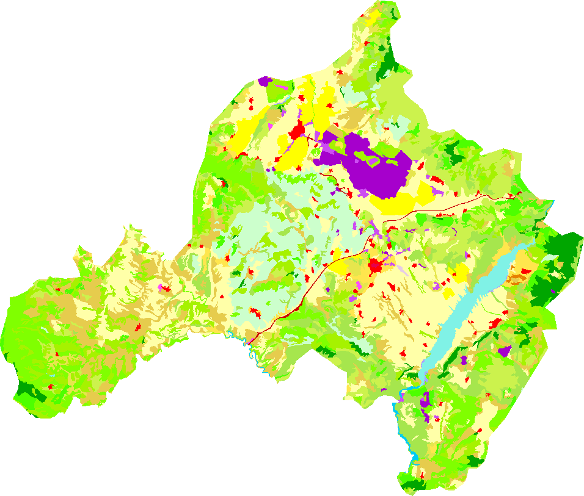
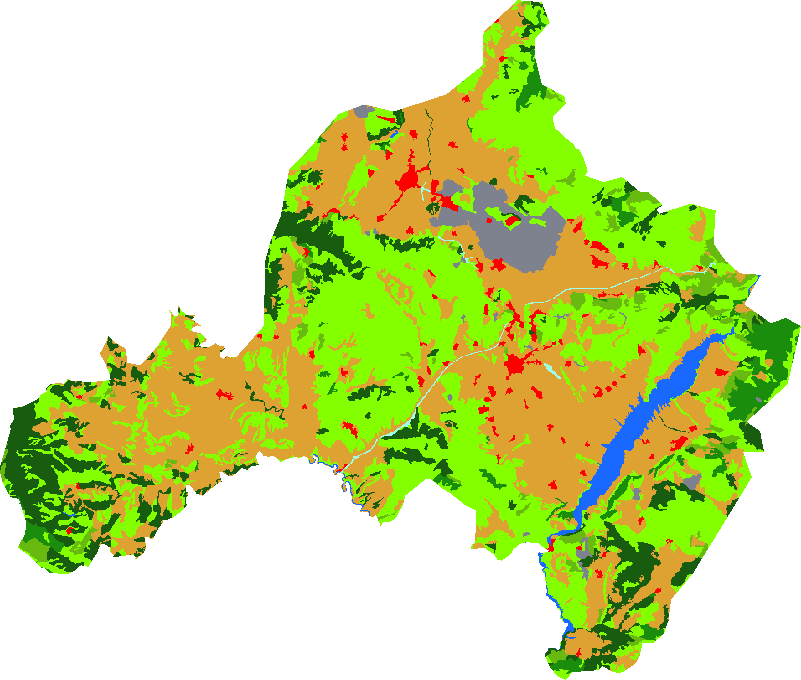
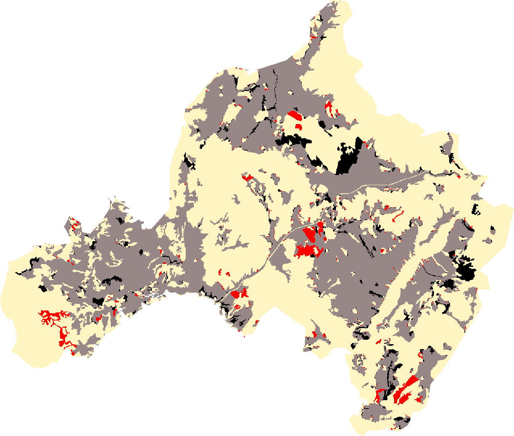
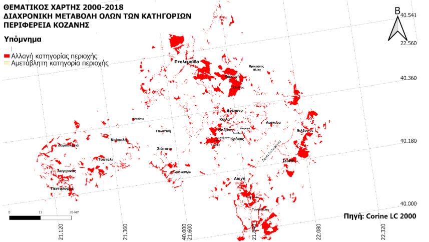

# Land Cover Change Analysis in Kozani (2000–2018)

A thesis project using **Google Earth Engine (JavaScript)** and **QGIS** to analyze land cover changes.

## Downloads
- 📄 Thesis PDF: (βάλε link εδώ)

## Method (overview)
1. Data import (CLC 2000 / 2018)
2. Reclassification into 9 categories
3. Map production (2000 & 2018)
4. Change detection
5. QGIS cartography

## Results
- Urban areas increased
- Agricultural areas decreased
- Forest classes changed (broad-leaved / coniferous / mixed)

## Figures

<figure style="text-align:center;">
  
  <figcaption><em>Corine Land Cover 2018</em></figcaption>
</figure>   

<figure style="text-align:center;">
  
  <figcaption><em>Reclassification 2018</em></figcaption>
</figure>   

<figure style="text-align:center;">
  
  <figcaption><em>Agricultural Change Detection</em></figcaption>
</figure> 
  
<figure style="text-align:center;">
  
  <figcaption><em>Change Detection </em></figcaption>
</figure> 
