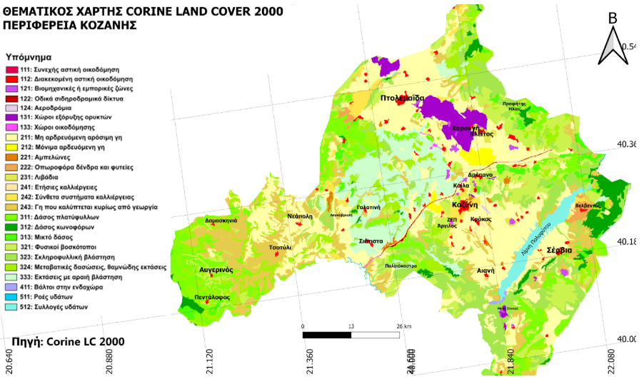
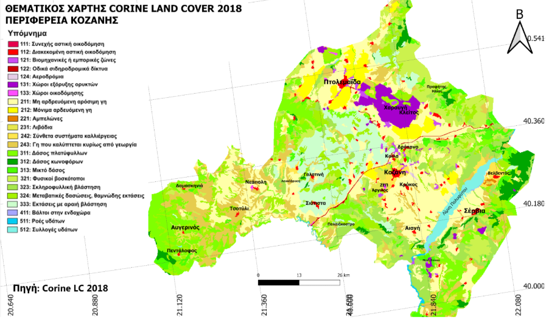
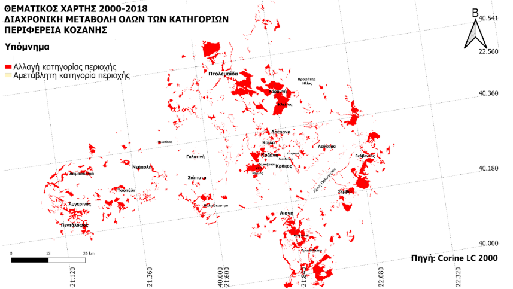
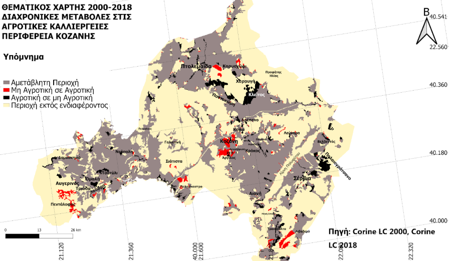
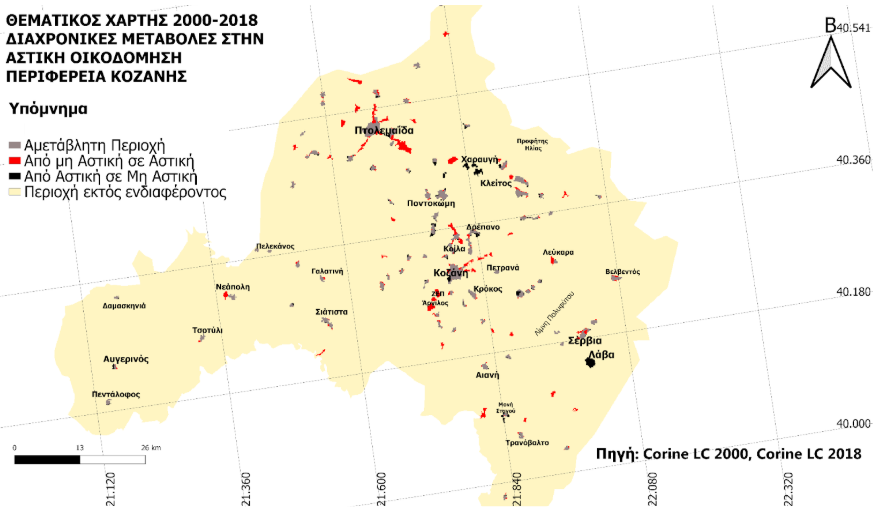
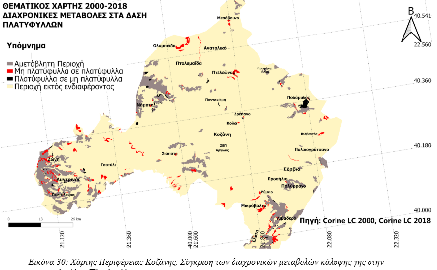
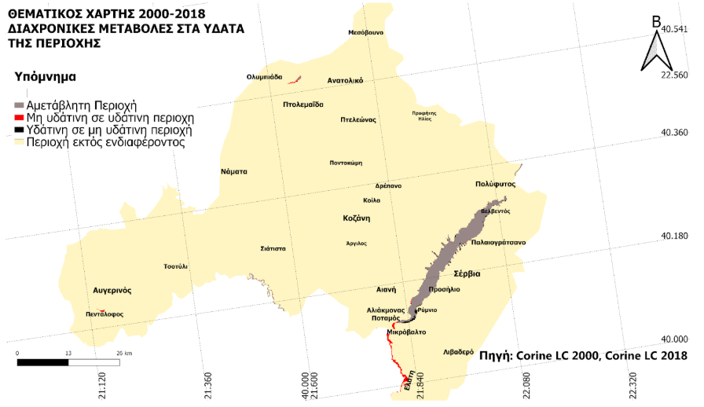
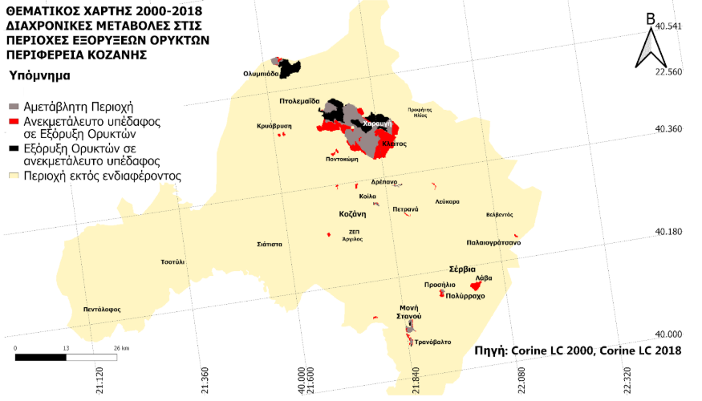
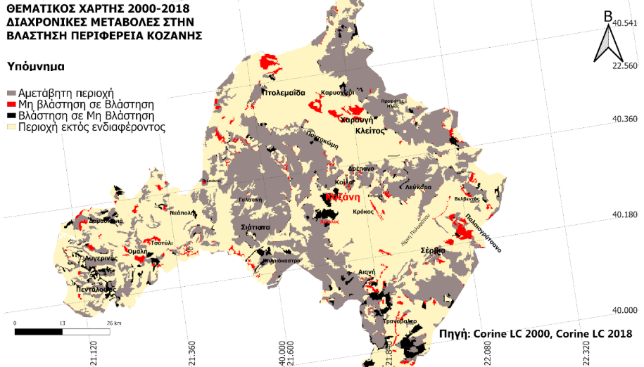

Land Cover Change Analysis in Kozani (2000–2018)
Project Overview
This project analyzes the spatiotemporal changes in land cover in the Kozani region (Greece) over a period of 18 years, using satellite imagery and Google Earth Engine (GEE).
The objective was to classify land cover types, detect changes between 2000 and 2018, and visualize them through thematic maps.

Technologies Used
Google Earth Engine (GEE) – for satellite image processing and classification

JavaScript – for scripting within the GEE environment

QGIS – for map editing and final visualization

Corine Land Cover (CLC) datasets – as the main data source for land cover classification

Imports Required
This project requires the following assets to be available in your GEE account:

geometry2: Region of Interest – The Kozani region.

CLC_2000: Corine Land Cover dataset from the year 2000.

CLC_2018: Corine Land Cover dataset from the year 2018.

vegetation: Set of selected points representing urban areas.(2018)

urban: Set of selected points representing urban areas.(2018)

water: Set of selected points representing water bodies.(2018)

roads: Set of selected points representing the road network.(2018)

etc

vegetation2000: Set of selected points representing urban areas.(2000)

urban2000: Set of selected points representing urban areas.(2000)

water2000: Set of selected points representing water bodies.(2000)

roads2000: Set of selected points representing the road network.(2000)

etc

Note:
These datasets must be manually uploaded to your GEE Assets or replaced with equivalent public datasets.
The provided script references these imports and will not run correctly without them.

Methodology
Import and preprocess CLC datasets for the years 2000 and 2018.

Reclassify land cover into nine major categories for analysis.

Use masks to isolate and qualitatively analyze changes within each land cover category separately.

Results
Significant increase in urban areas and decrease in agricultural lands.

Notable changes in vegetation cover and water bodies over the 18-year period.

Extraction of spatial statistics and change detection for decision-making and planning purposes.

Screenshots
-----------
#1# Land Cover Classification Maps

### Year 2000

----------------------------------------------------------------

### Year 2018

----------------------------------------------------------------

#2# Land Cover Change Overview Map

Below is the overall map showing land cover changes in the Kozani region between 2000 and 2018:

- **White areas** represent unchanged regions.
- **Red areas** represent regions where land cover has changed.

The map provides a visual summary of land cover changes detected over an 18-year period. 
By using classification comparisons of CLC datasets from 2000 and 2018, unchanged areas appear in white, while areas with any land cover changes appear in red.
----------------------------------------------------------------

#3# Agricultural Land Cover Change Map

This map focuses specifically on changes in agricultural land cover between 2000 and 2018:

- **Beige areas**: Outside of the agricultural land analysis (no interest).
- **Grey areas**: Regions that were agricultural in 2000 and remained agricultural in 2018.
- **Red areas**: Regions that were not agricultural in 2000 but became agricultural by 2018.
- **Black areas**: Regions that were agricultural in 2000 but changed to a different land use by 2018.

This focused analysis enables a deeper understanding of agricultural land dynamics over time, providing useful insights for sustainable land management and spatial planning strategies.
----------------------------------------------------------------

#4# Urban Areas

----------------------------------------------------------------

#5# Forest Areas

----------------------------------------------------------------

#6# Water Bodies

----------------------------------------------------------------

#7# Minerals

----------------------------------------------------------------

#8# Vegetation Cover Changes

This map displays the changes in vegetation cover between 2000 and 2018:

- **Beige areas**: Outside of vegetation land cover analysis.
- **Grey areas**: Regions that remained covered by vegetation during both years.
- **Red areas**: Regions that were not vegetated in 2000 but became vegetated by 2018.
- **Black areas**: Regions that were vegetated in 2000 but changed to a different land use by 2018.

----------------------------------------------------------------

Author
[Tsichlakidou Paraskevi, Tezas Hlias-Stylianos]
Bachelor's Degree in Electrical and Computer Engineering
University of Western Macedonia